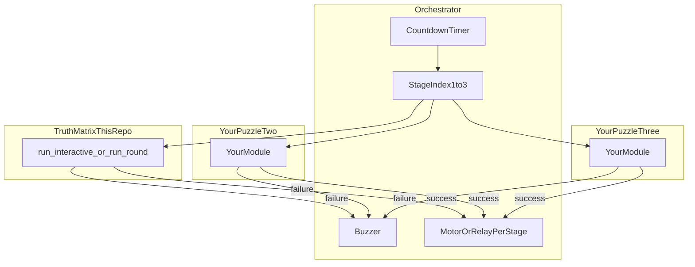

# Escape Room Puzzle System (Truth Matrix + extensible stages)

## 1. Project overview

We propose to design and build an **interactive, multiplayer escape-room style puzzle system** that integrates motorized actuation, AI-driven reasoning, and real-time feedback mechanisms.

The experience will consist of **three sequential mini-puzzles**, each unlocking the next stage of the game. Players must collaboratively solve each challenge under time pressure. The system incorporates:

- **Automated validation** using sensors  
- **Audible feedback** through buzzers for incorrect attempts  
- **A countdown timer** to enhance immersion and urgency  
- **Cooperative multiplayer** play  

**This repository** currently implements **Stage 1 — “Truth Matrix”**: a switch-based boolean logic puzzle on a Raspberry Pi, with a **deterministic solver** (fair scoring) and **optional AI** for puzzle generation and hints only. Stages 2 and 3 (additional physical puzzles, shared timer, buzzers, motors) are described below as integration points so you can connect new modules without rewriting the core logic.

---

## 2. Project objectives

The objectives of this project are:

1. Design a fully functional **3-stage** escape-room puzzle.  
2. Use **motorized actuators** to open compartments upon correct solutions.  
3. Integrate **buzzers** to provide feedback for incorrect attempts.  
4. Include a **real-time countdown timer**.  
5. Develop a **cooperative multiplayer** experience.  

Objectives 2–5 are **system-level**; this codebase provides the **validation and GPIO patterns** for Stage 1 and a clear way to plug in other stages and shared services.

---

## 3. What is implemented here

| Area | Location / behavior |
|------|---------------------|
| Puzzle format | [schema/puzzle.schema.json](schema/puzzle.schema.json) — JSON AST for statements A–E |
| Scoring | [src/truth_matrix/evaluator.py](src/truth_matrix/evaluator.py) — must use code, not an LLM |
| Uniqueness check | [src/truth_matrix/validator.py](src/truth_matrix/validator.py) — brute-force; rejects 0 or multiple solutions |
| Hardware abstraction | [src/truth_matrix/gpio_controller.py](src/truth_matrix/gpio_controller.py) — Pi vs mock |
| Game loop (one module) | [src/truth_matrix/game.py](src/truth_matrix/game.py) — strikes, hints, LEDs, optional OLED |
| AI (optional) | [src/truth_matrix/llm_author.py](src/truth_matrix/llm_author.py) — generate → **validate** → save |
| Wiring | [hardware/WIRING.md](hardware/WIRING.md) |

**CLI** (from repo root, with `PYTHONPATH=src` or after `pip install -e .`):

```bash
python -m truth_matrix validate puzzles/example_plan.json
python -m truth_matrix generate --out puzzles/new.json --backend template
python -m truth_matrix play --puzzle puzzles/example_plan.json        # on Pi
TRUTH_MATRIX_MOCK_GPIO=1 python -m truth_matrix play --mock          # dev without GPIO
```

---

## 4. How another puzzle connects to this flow

Think in layers: **orchestration** (multiplayer + timer + stages) vs **stage modules** (each physical puzzle). This repo is one **stage module** plus shared **puzzle definition** and **validator** utilities.

### 4.1 Integration architecture (recommended)



**Contract between orchestrator and any stage:**

1. **Start:** orchestrator calls the active stage’s `run()` (blocking) or polls a non-blocking API you define.  
2. **Success:** stage returns or emits `solved=True` → orchestrator advances `stage += 1`, triggers **motor/relay** for that compartment, resets or continues timer per your rules.  
3. **Failure:** stage returns or emits `wrong_attempt=True` → orchestrator triggers **buzzer** and may decrement time or strikes globally.  
4. **Timer:** owned by orchestrator; stages receive `time_remaining` or `deadline` if you need UI pressure inside a module.  

The Truth Matrix module already exposes **`run_round(state, switches)`** and **`GameState`** (strikes, solved); you can wrap `run_interactive` in a thread or replace the inner loop with calls from your orchestrator that supply GPIO reads and drive LEDs/buzzer/timer yourself.

### 4.2 Connecting another *Truth Matrix–style* puzzle (new JSON only)

No code changes are required if the puzzle stays in the **same schema**:

1. Author `statements` and `display` for A–E (see [puzzles/example_plan.json](puzzles/example_plan.json)).  
2. Validate:  
   `python -m truth_matrix validate path/to/your_puzzle.json`  
3. Point the runtime at the file:  
   `python -m truth_matrix play --puzzle path/to/your_puzzle.json`  

Generated content from AI must pass the same validator (`generate` command already rejects invalid or non-unique puzzles).

### 4.3 Connecting a *different physical puzzle* (Stage 2 or 3)

Reuse these **patterns** from this repo; implement a **new Python package or module** that matches the orchestrator contract:

| Concern | How this repo does it | What you add |
|--------|------------------------|--------------|
| Fair validation | Deterministic code, not LLM | Your solver or rule checks in Python |
| Inputs | `GPIOBackend` reads switches/sensors | Your sensors → booleans or a small state struct |
| Outputs | Green/red LEDs | Your LEDs, locks, or signals to orchestrator |
| Failure | `run_round` + strikes | Emit failure to orchestrator → **buzzer** |
| Success | `state.solved` | Notify orchestrator → **motor opens compartment** |

**Minimal glue code sketch** (orchestrator side, conceptual):

```python
# Pseudocode: orchestrator, not in this repo yet
def run_escape_room():
    timer = Countdown(15 * 60)
    while timer.running and stage <= 3:
        if stage == 1:
            success = run_truth_matrix_stage(timer, buzzer, motor_m1)  # wrap truth_matrix.game
        elif stage == 2:
            success = run_your_puzzle_two(timer, buzzer, motor_m2)
        else:
            success = run_your_puzzle_three(timer, buzzer, motor_m3)
        if success:
            stage += 1
```

`run_truth_matrix_stage` might call `validate_puzzle_json`, then loop: read GPIO → `run_round` → on failure call `buzzer.beep()` and read timer; on success call `motor_m1.open()`.

### 4.4 Buzzers, motors, and timer (not yet wired in this repo)

- **Buzzer:** add a GPIO output (or a small driver board) and call it from the **orchestrator** on any stage failure event, or from a thin wrapper around `run_round` when it returns failure.  
- **Motor / compartment:** use a relay or motor driver on separate GPIO pins; trigger only from orchestrator on **stage success** so ordering stays centralized.  
- **Timer:** implement once (thread or `asyncio` + callbacks); pass remaining time into UIs or optional displays for each stage.  

Keeping timer and global strike policy in **one process** avoids races between stages.

### 4.5 Environment variables (Truth Matrix)

See [hardware/WIRING.md](hardware/WIRING.md). Common options:

- `TRUTH_MATRIX_MOCK_GPIO=1` — software-only testing  
- `TRUTH_MATRIX_PIN_*` — BCM pin overrides  
- `TRUTH_MATRIX_USE_OLED=1` — optional SSD1306  
- `TRUTH_MATRIX_USE_TILT` / `TRUTH_MATRIX_USE_REED` — gate Confirm until sensors read “armed”  
- LLM: `TRUTH_MATRIX_LLM_BACKEND`, `OPENAI_API_KEY`, `OLLAMA_HOST`, etc.  

---

## 5. Install

```bash
cd aipi-590-escape-room-puzzle-
python3 -m venv .venv
source .venv/bin/activate   # Windows: .venv\Scripts\activate
pip install -e ".[display]"   # optional: OLED; base install from pyproject.toml
```

On a Raspberry Pi, install **gpiozero** and run with real wiring; use mock mode on a laptop for puzzle authoring.

---

## 6. Summary

- This project delivers a **complete Stage 1** puzzle with **schema, solver, Pi GPIO, and optional AI**.  
- **Another puzzle** joins the flow by implementing the same **success/failure contract** with a central **orchestrator** that owns **timer, buzzer, and motors**.  
- **New Truth Matrix content** is just **validated JSON** plus `--puzzle` at play time.  
- **New physical puzzles** should copy the **deterministic validation** idea and plug into the orchestrator as **Stage 2** and **Stage 3**.

For pin-level detail, see [hardware/WIRING.md](hardware/WIRING.md).
